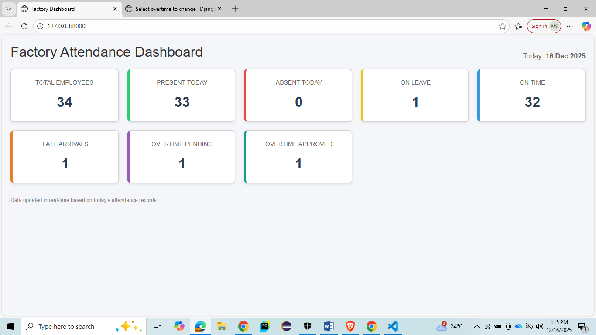
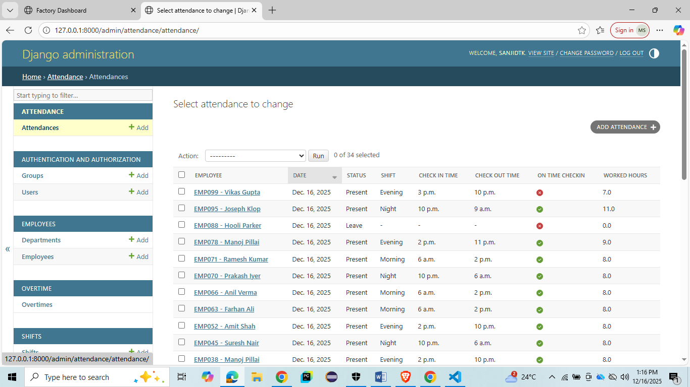
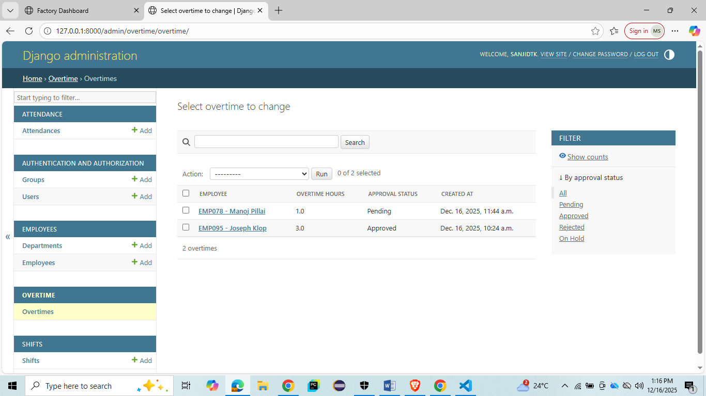

# Factory Attendance Portal

A full-stack **Django-based Factory Attendance & Overtime Management System**
built to simulate real-world HR and operations workflows.

---

## 🔹 Features

### 👥 Employee Management
- Departments & designations
- Active / inactive employees
- Admin-managed employee records

### 🕒 Attendance Management
- Morning / Evening / Night shifts
- Check-in & check-out tracking
- On-time vs late arrival detection
- Cross-midnight (night shift) handling

### ⏱️ Overtime Management
- Automatic overtime calculation
- Pending / Approved / Rejected workflow
- Manager approval with decision reason

### 📊 Interactive Dashboard
- Live attendance KPIs
- Present / Absent / Leave counts
- On-time & late arrivals
- Overtime status summary
- Clickable tiles showing employee details (AJAX)

### 🤖 Test Automation Ready
- Selenium-compatible admin UI
- Data-driven testing using JSON / Excel

---

## 🔹 Tech Stack

- **Backend:** Django
- **Database:** SQLite (development)
- **Frontend:** HTML, CSS, Bootstrap
- **JS:** Vanilla JavaScript (AJAX)
- **Automation:** Selenium (Java)
- **Version Control:** Git + GitHub

---

## 🔹 Screenshots

### Dashboard


###  Admin


### Attendance Admin


### Overtime Approval


---

## 🔹 How to Run Locally

```bash
python -m venv venv
venv\Scripts\activate
pip install -r requirements.txt
python manage.py migrate
python manage.py createsuperuser
python manage.py runserver
